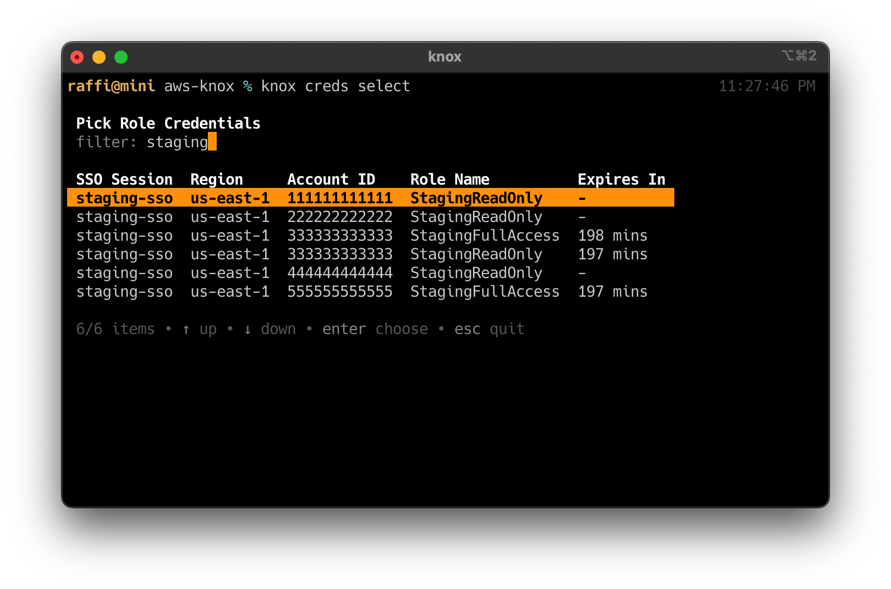

# Knox
> AWS credential process helper

<p align="center" >
  
</p>

## About

**Knox** is a powerful utility designed to simplify and streamline the management of AWS credentials. Whether you're frequently switching between different AWS profiles or handling credential issuance in an SSO environment, Knox provides a straightforward CLI tool to manage these tasks effortlessly.

Key features include:

- **Profile Management:** Commands like `knox select`, `knox last-used`, and `knox clean` make it easy to navigate and manipulate your AWS credentials.
- **Seamless Configuration Handling:** Knox reads your `~/.aws/config` file to get configured SSO sessions and saves used role credentials into `~/.aws/knox` for future use.
- **SSM Session Management:** The `knox connect` command simplifies the process of starting an SSM session with an EC2 instance. This feature is particularly useful for users who frequently SSH into EC2 instances using SSM Session Manager. With Knox, you can easily switch between different AWS profiles and start an interactive session with a specific instance using a single command.

Knox helps maintain efficient and secure AWS credential management, making it an invaluable tool for your development, staging, and production environments.

## Install

<details>
  <summary>Darwin</summary>

  ### Intel & ARM

  ```shell
  brew tap null93/tap
  brew install aws-knox
  ```
</details>

<details>
  <summary>Debian</summary>

  ### amd64

  ```shell
  curl -sL -o ./aws-knox_2.3.0_amd64.deb https://github.com/null93/aws-knox/releases/download/2.3.0/aws-knox_2.3.0_amd64.deb
  sudo dpkg -i ./aws-knox_2.3.0_amd64.deb
  rm ./aws-knox_2.3.0_amd64.deb
  ```

  ### arm64

  ```shell
  curl -sL -o ./aws-knox_2.3.0_arm64.deb https://github.com/null93/aws-knox/releases/download/2.3.0/aws-knox_2.3.0_arm64.deb
  sudo dpkg -i ./aws-knox_2.3.0_arm64.deb
  rm ./aws-knox_2.3.0_arm64.deb
  ```
</details>

<details>
  <summary>Red Hat</summary>

  ### aarch64

  ```shell
  rpm -i https://github.com/null93/aws-knox/releases/download/2.3.0/aws-knox-2.3.0-1.aarch64.rpm
  ```

  ### x86_64

  ```shell
  rpm -i https://github.com/null93/aws-knox/releases/download/2.3.0/aws-knox-2.3.0-1.x86_64.rpm
  ```
</details>

<details>
  <summary>Alpine</summary>

  ### aarch64

  ```shell
  curl -sL -o ./aws-knox_2.3.0_aarch64.apk https://github.com/null93/aws-knox/releases/download/2.3.0/aws-knox_2.3.0_aarch64.apk
  apk add --allow-untrusted ./aws-knox_2.3.0_aarch64.apk
  rm ./aws-knox_2.3.0_aarch64.apk
  ```

  ### x86_64

  ```shell
  curl -sL -o ./aws-knox_2.3.0_x86_64.apk https://github.com/null93/aws-knox/releases/download/2.3.0/aws-knox_2.3.0_x86_64.apk
  apk add --allow-untrusted ./aws-knox_2.3.0_x86_64.apk
  rm ./aws-knox_2.3.0_x86_64.apk
  ```
</details>

<details>
  <summary>Arch</summary>

  ### aarch64

  ```shell
  curl -sL -o ./aws-knox-2.3.0-1-aarch64.pkg.tar.zst https://github.com/null93/aws-knox/releases/download/2.3.0/aws-knox-2.3.0-1-aarch64.pkg.tar.zst
  sudo pacman -U ./aws-knox-2.3.0-1-aarch64.pkg.tar.zst
  rm ./aws-knox-2.3.0-1-aarch64.pkg.tar.zst
  ```

  ### x86_64

  ```shell
  curl -sL -o ./aws-knox-2.3.0-1-x86_64.pkg.tar.zst https://github.com/null93/aws-knox/releases/download/2.3.0/aws-knox-2.3.0-1-x86_64.pkg.tar.zst
  sudo pacman -U ./aws-knox-2.3.0-1-x86_64.pkg.tar.zst
  rm ./aws-knox-2.3.0-1-x86_64.pkg.tar.zst
  ```
</details>

## Setup

Recommended configuration for `~/.aws/config`, feel free to swap out the commands to suit your needs:

```ini
[default]
region = us-east-1
output = json
credential_process = knox select

[profile last]
region = us-east-1
output = json
credential_process = knox last-used

[sso-session development-sso]
sso_region = us-east-1
sso_registration_scopes = sso:account:access
sso_start_url = https://d-2222222222.awsapps.com/start

[sso-session staging-sso]
sso_region = us-east-1
sso_registration_scopes = sso:account:access
sso_start_url = https://d-1111111111.awsapps.com/start

[sso-session production-sso]
sso_region = us-east-1
sso_registration_scopes = sso:account:access
sso_start_url = https://d-0000000000.awsapps.com/start
```

## Configuration File

The Knox config file is located at `~/.aws/knox/config.yaml`. Below are the configuration options available:

| Option                | Default | Description                                                                                            |
|-----------------------|---------|--------------------------------------------------------------------------------------------------------|
| `default_connect_uid` | `0`     | Default user ID for SSM sessions initiated with the `knox connect` command.                            |
| `max_items_to_show`   | `10`    | Maximum number of items to display when listing profiles or options.                                   |
| `select_cached_first` | `false` | When selecting credentials, specifies whether to default to showing the cached role credentials first. |
